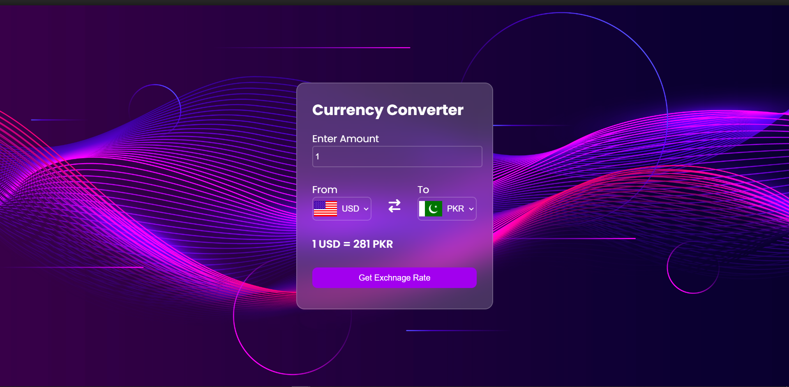

# Currency Converter

## Description
This project is a web-based currency converter that allows users to convert currencies using real-time exchange rates fetched from the ExchangeRate-API. It supports conversion between USD and other selected currencies.

## Features
- Conversion from USD to other currencies.
- Dynamic flag images based on selected currencies.
- Error handling for failed API requests.
- Responsive design for mobile and desktop.

## Usage
1. Select the currency you want to convert from (USD by default).
2. Select the currency you want to convert to.
3. Enter the amount you want to convert.
4. Click the "Convert" button to see the converted amount.
5. 
## API Reference
This project uses the [ExchangeRate-API](https://www.exchangerate-api.com/) to fetch real-time exchange rates. You can refer to their documentation for more details.

## Credits
- Flag images fetched from [Flags API](https://www.flagsapi.com/).

## License
This project is licensed under the MIT License. See the [LICENSE](LICENSE) file for details.

## Screenshots

## UI

## USD to PKR

## Contributing
If you'd like to contribute to this project, feel free to fork the repository and submit a pull request!

## THANK YOU !!

